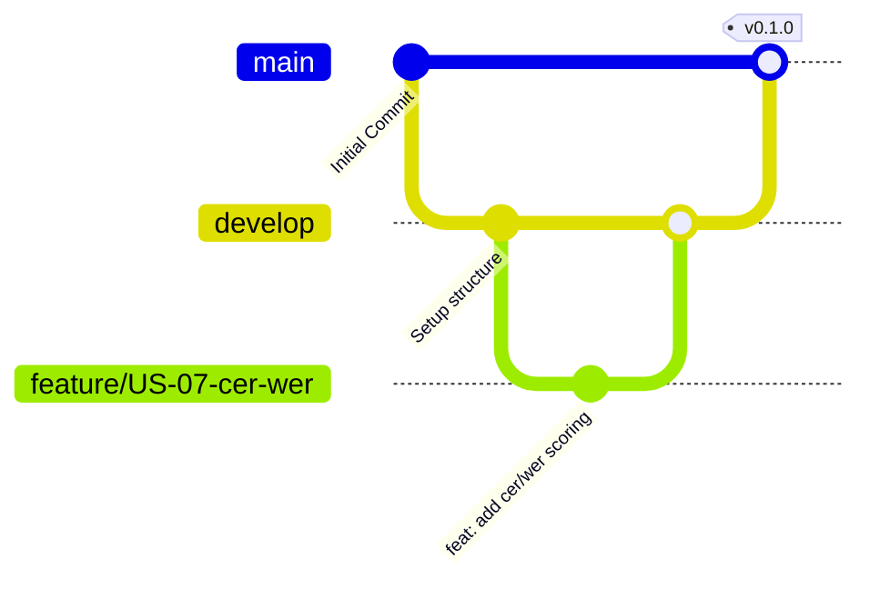

# Git Workflow and Contribution Guidelines

This document outlines the Git branching strategy, commit message rules, issue naming conventions, and project board standards for the **Arabic OCR Multimodal** project.

---

## 1. Branching Strategy

We follow a modified **Git Flow** strategy to coordinate development.



* **`main`**: Production branch. Contains only stable, production-ready code. Pull requests are only merged here from `develop` at the end of a sprint/release.
* **`develop`**: Integration branch. All features and bugfixes are merged into `develop` first.
* **`feature/<story-id>-<short-description>`**: Used for implementing new user stories. (e.g. `feature/US-07-cer-wer-pipeline`). Created from `develop`, merged back to `develop`.
* **`bugfix/<issue-id>-<short-description>`**: Used to fix bugs during active sprints. Created from `develop`, merged back to `develop`.
* **`hotfix/<issue-id>-<short-description>`**: Used for urgent production fixes. Created from `main`, merged back to both `main` and `develop`.

---

## 2. Commit Message Conventions

We follow **Conventional Commits** to keep git history clean, readable, and machine-parsable.

### Commit Format
```
<type>(<scope>): <description>

[optional body]

[optional footer(s)]
```

### Allowed Types
* `feat`: A new feature (e.g. `feat(eval): add character error rate calculation`)
* `fix`: A bug fix (e.g. `fix(eval): handle division by zero on empty ground truth`)
* `docs`: Documentation changes only (e.g. `docs(git): write git workflow guide`)
* `style`: Changes that do not affect the meaning of the code (formatting, missing semi-colons, etc.)
* `refactor`: A code change that neither fixes a bug nor adds a feature
* `test`: Adding missing tests or correcting existing tests (e.g. `test(eval): add edge case tests for arabic diacritics`)
* `chore`: Build process, dependencies, tooling, or repository updates (e.g. `chore: update requirements.txt`)

### Examples
* `feat(eval): US-07 implement jiwer-based CER/WER scorer`
* `fix(schemas): US-03 validate document_id type to prevent string mismatch`

---

## 3. Pull Request (PR) Policy

Before any PR can be merged into `develop` or `main`, it must meet the following criteria (DoD):
1. **Self-Review**: The author has reviewed their own changes.
2. **Reviewers**: At least **one peer review** approval is required.
3. **CI Pipeline**: The GitHub Actions workflow must pass (Formatting with `black`, Linting with `flake8`, Tests with `pytest`).
4. **Interface Contracts**: All data schemas produced/consumed are verified against `/schemas/`.
5. **No conflicts**: Branch is rebased or merged with latest `develop`.

---

## 4. Issue Naming and Task Tracking

Issues in GitHub/Jira must follow this format:
`[US-XX] <User Story Short Name>` or `[BUG-XX] <Bug Title>`

### Project Board Columns
We use a 5-column Board to monitor Sprint progress:
1. **Backlog**: All user stories not yet planned.
2. **Todo**: Stories selected for the current active Sprint.
3. **In Progress**: Tasks actively being worked on.
4. **Review/QA**: Pull Request open, waiting for peer review and CI verification.
5. **Done**: Merged into `develop`, satisfies all DoD.
